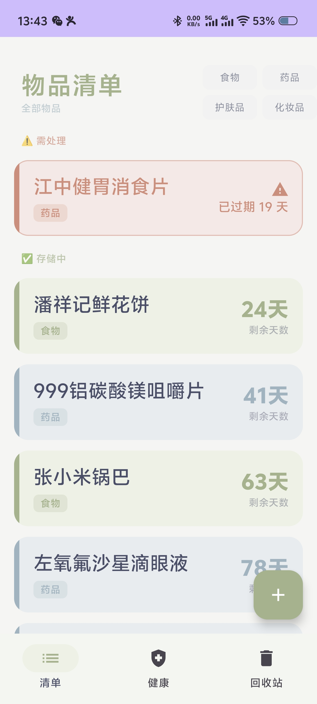
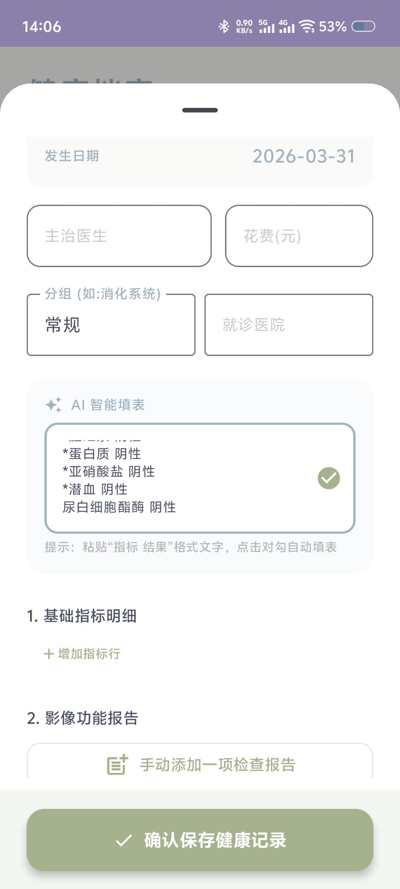
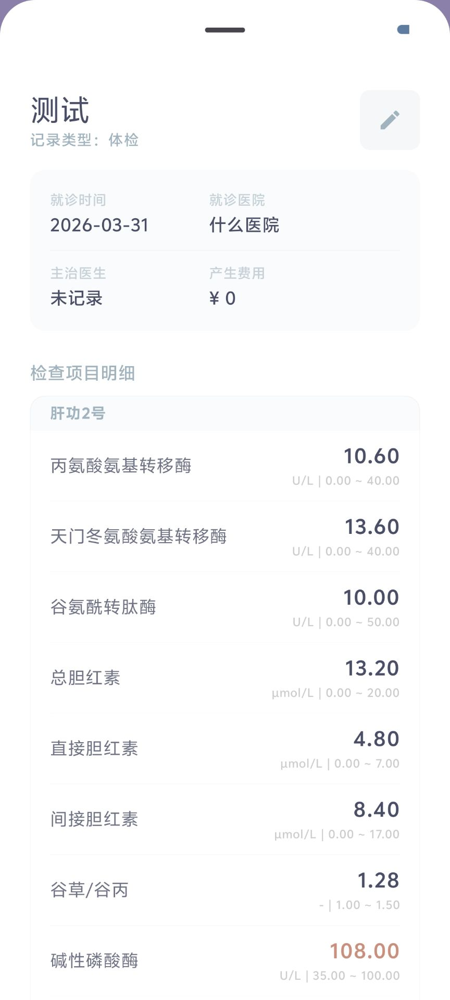
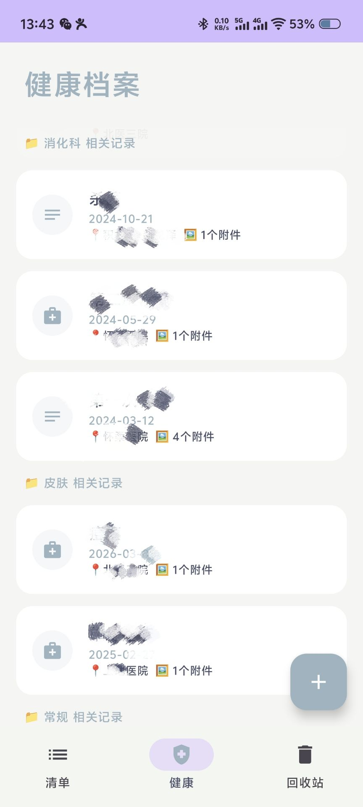

# 过期物品记录APP

**用于记录过期物品和建立个人健康档案的APP**

## 🚀 核心功能

### 1. 物品期限管理
*   **录入**：支持「生产日期 + 保质期（月）」自动换算有效期，或直接输入“有效期至”。
*   **状态分层**：
    *   ✅ **存储中**：清新绿条提示，清晰显示剩余天数。
    *   ⚠️ **即将过期**：琥珀黄边框温和提醒。
    *   🚨 **已过期**：枯玫瑰红视觉覆盖，自动**置顶**显示。
*   **灵活分类**：内置食物、药品、护肤品、化妆品四种精致微型矩阵筛选器，通过点击“物品清单”取消筛选。

    

### 2. 健康档案
*   **体检**

    A. 支持将 AI（如 ChatGPT/文心一言）总结的「指标 结果」文本一键粘贴，系统自动识别并填充至 80+ 项专业体检指标（血常规、尿常规、肝肾功等）。

    B. 超出参考值会标红

    C. 支持手动添加指标

    <table>
        <tr>
            <td></td>
            <td></td>
            <td></td>
        </tr>
    </table>

*   **结构化病历**：按「就诊疾病」自动分组展示（如：胃病、牙科）。
*   **影像报告详情**：支持直接内嵌展示 **PDF 报告**和多张高清检查照片。
*   **预警**：根据内置参考值范围，异常指标（如 BMI 偏低、尿酸偏高）将自动变红提醒。

### 3. 回收站
*   **回收站**：清单物品与健康记录均支持「左滑删除」进入回收站，支持一键恢复或带确认弹窗的永久抹除。
*   **持久化存储**：基于 Room 数据库，支持 Android 系统级自动备份与跨设备数据迁移。
*   **离线优先**：所有 OCR 与数据解析均在本地完成，保护个人隐私。

---

## 📖 使用指南

### 指标录入
1.  使用手机自带 AI 或第三方大模型识别文字。
2.  告诉 AI：“请按『指标名称 数值』的格式总结这段文字”。
3.  新增记录页，粘贴至蓝色「AI 智能填表」框。
4.  点击勾选图标，下方的 80 多项格子将瞬间自动填好。

### 附件管理
*   点击「添加照片或PDF报告」即可上传，PDF 附件会自动生成带红色图标的预览长卡片。

### 回收站操作
*   主界面左滑条目即可删除。
*   若要找回，点击底栏「回收站」，点击绿色图标恢复，点击红色图标永久删除。

---

## 🛠️ 技术栈

*   **UI 框架**: Jetpack Compose (Material 3)
*   **数据库**: Room Persistence Library (KSP 驱动)
*   **文字解析**: Regex + Fuzzy Matching Logic
*   **图像加载**: Coil
*   **文件处理**: Android PDF Renderer API

---

## 📦 如何安装

1.  前往 Releases。
2.  下载最新的 `app-release.apk`。
3.  在安卓设备上安装（需开启“允许安装未知来源应用”）。